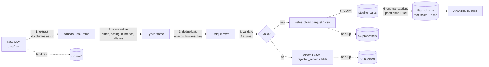
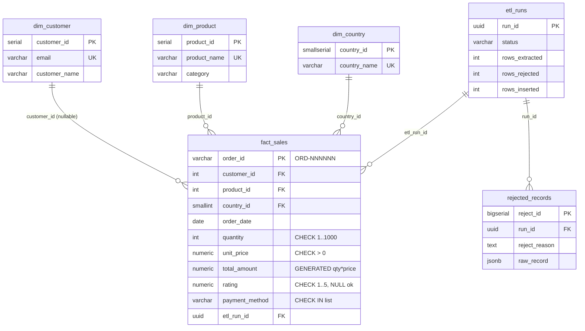

# Sales ETL Pipeline: Python → PostgreSQL → AWS S3

A small, production-shaped data pipeline. It takes a deliberately **dirty** sales-transactions
export (12,000 rows), then cleans, standardizes, deduplicates and validates it. It loads the
result into a **PostgreSQL star schema** and lands and backs up every file in **Amazon S3**.

```
python run_pipeline.py
```

| | |
|---|---|
| **Domain** | E-commerce / retail sales transactions |
| **Stack** | Python 3.12 · pandas · psycopg2 · boto3 · PostgreSQL 16 (Docker) · Amazon S3 |
| **Raw data** | 12,000 rows × 11 columns, with dirty values injected on purpose ([`data/raw/sales_raw.csv`](data/raw/sales_raw.csv)) |
| **Result** | 10,855 clean rows loaded; 1,145 removed, each with a reason (480 duplicates + 665 invalid) |
| **Runtime** | ~4 s end to end locally |

---

## Contents
1. [Architecture](#1-architecture)
2. [Quick start](#2-quick-start)
3. [The dataset](#3-the-dataset)
4. [ETL pipeline](#4-etl-pipeline)
5. [Database design](#5-database-design)
6. [Analytical queries & indexing](#6-analytical-queries--indexing)
7. [AWS S3 integration](#7-aws-s3-integration)
8. [Scalability & architecture thinking](#8-scalability--architecture-thinking)
9. [Project structure](#9-project-structure)

---

## 1. Architecture



Design principles:

- **Nothing is silently dropped.** Every removed row ends up in `rejected_records` (and a CSV) with its original raw values and a human-readable reason.
- **Idempotent.** Re-running on the same file inserts and updates nothing. A corrected file updates only the rows that changed. The upsert key is `order_id`.
- **Atomic.** The warehouse load is one transaction, so a run lands completely or not at all.
- **Auditable.** Every run gets a UUID. The `etl_runs` table records its counts and status, and every fact row records the `etl_run_id` that last wrote it. Each run also writes its own log file in `logs/`.
- **No secrets in code.** All configuration comes from environment variables (`.env`, git-ignored).

---

## 2. Quick start

**Prerequisites:** Docker, Python 3.10+. You need an AWS account only if you want the S3 step.

```bash
# 1. configure
cp .env.example .env              # then edit PG_PASSWORD (and AWS values, see section 7)

# 2. start PostgreSQL 16. The schema and indexes are created automatically on first start.
docker compose up -d

# 3. python environment
python3 -m venv .venv && source .venv/bin/activate
pip install -r requirements.txt

# 4. (optional) regenerate the raw dataset. It is deterministic: seed 42, 12,000 rows.
python scripts/generate_data.py

# 5. run the pipeline
python run_pipeline.py --skip-s3        # fully local
python run_pipeline.py                  # with S3 (needs S3_ENABLED=true + credentials)

# 6. explore the results
docker exec -it sales_etl_postgres psql -U etl_user -d sales_dw
docker exec -i  sales_etl_postgres psql -U etl_user -d sales_dw < sql/03_analytical_queries.sql

# 7. index benchmark (builds a temporary 1M-row copy, writes docs/benchmark_results.md)
python scripts/benchmark_indexes.py
```

> PostgreSQL is exposed on host port **5434** by default (`PG_PORT`). This avoids clashing with a local install on 5432.

CLI options:

| Flag | Effect |
|---|---|
| `--input PATH` | Raw CSV to process (default `data/raw/sales_raw.csv`) |
| `--generate` | Regenerate the raw dataset before running |
| `--skip-s3` | Disable S3 for this run, even if `S3_ENABLED=true` |

Sample run output:

```
── EXTRACT ──
Extracted 12,000 rows x 11 columns from sales_raw.csv
── TRANSFORM ──
category: imputed 344 from product history, 0 set to 'Uncategorized'
country: 352 missing values set to 'Unknown'
Deduplication: 360 exact duplicates, 120 duplicate order_ids removed
── VALIDATE ──
  rule failed: customer_email invalid           129 rows
  rule failed: quantity <= 0                    107 rows
  rule failed: rating out of range 1-5          114 rows
  ...
Validation: 10,855 valid, 665 rejected
── LOAD POSTGRES ──
COPY -> staging_sales: 10,855 rows
Merged into fact_sales: 10,855 inserted, 0 updated, 0 unchanged
Logged 1,145 rejected records to rejected_records
RUN SUMMARY  ...   inserted / updated / unchanged  10,855 / 0 / 0
```

A second run of the same file reports `0 inserted, 0 updated, 10,855 unchanged`.

---

## 3. The dataset

[`scripts/generate_data.py`](scripts/generate_data.py) generates a synthetic export from an online store. It uses Faker and a fixed seed, so the output is reproducible. The data covers 28 products in 7 categories, ~3,000 customers, 10 countries and order dates from Jan 2023 to Jun 2025, with a mild growth trend.

| Column | Type (clean) | Dirt injected |
|---|---|---|
| `order_id` | string `ORD-NNNNNN` | duplicates with different case or whitespace (`ord-001234`, ` ORD-001234`) |
| `customer_name` | string | UPPER / lower case, stray whitespace |
| `customer_email` | string | missing, upper case, invalid (`not-an-email`, missing `@`) |
| `product_name` | string | case variants, missing |
| `category` | string | case variants, whitespace, missing |
| `quantity` | integer | negative, zero, `two`, `1.5`, empty |
| `unit_price` | decimal | `$1,299.00`, `USD 24.99`, `1,299.00`, `free`, negative, missing |
| `rating` | decimal 1–5 | missing (unrated), out of range (`7`, `-1`, `10`) |
| `country` | string | aliases (`USA`, `U.S.`, `us`, `UK`, `england`, `LK`, `Srilanka`), missing |
| `order_date` | date | 5 different formats, future dates, `31/02/2024`, `yesterday`, empty |
| `payment_method` | string | aliases (`CC`, `COD`, `wire`, `Pay Pal`), `null` / `N/A` |

On top of this, ~3% of rows are **exact duplicates** (the same batch exported twice) and ~1% re-use an existing `order_id` with different formatting.

---

## 4. ETL pipeline

| Stage | Module | What it does |
|---|---|---|
| Extract | [`etl/extract.py`](etl/extract.py) | Reads every column **as a string**, with pandas NA-guessing turned off, so nothing is coerced implicitly. Checks the expected columns are present and tags each row with its `source_row` number for traceability. |
| Standardize | [`etl/transform.py`](etl/transform.py) | Trims whitespace and maps null tokens (`""`, `N/A`, `null`, `-`) to NULL. Converts names to title case and emails to lower case. Collapses product-name case variants onto the most frequent spelling (so `USB-C Hub` is not mangled to `Usb-C Hub`). Maps aliases for category, country and payment method. Parses prices (`$1,299.00` → `1299.00`) and dates, trying 5 explicit formats in a fixed order. |
| Clean missing values | `transform.py` | Uses a policy per column (below). |
| Deduplicate | `transform.py` | Pass 1 removes exact duplicate raw rows. Pass 2 removes duplicate normalized `order_id`s, keeping the first occurrence. |
| Validate | [`etl/validate.py`](etl/validate.py) | 19 vectorized rules that mirror the DB `CHECK` constraints. A row lists **every** rule it fails, e.g. `quantity <= 0; rating out of range 1-5`. |
| Log rejects | `run_pipeline.py`, `etl/load.py` | Writes `data/rejected/rejected_<run_id>.csv` (reason + original values) and the `rejected_records` table (raw row as JSONB). |
| Load | [`etl/load.py`](etl/load.py) | `COPY` → `staging_sales` (UNLOGGED), then one transaction that upserts the dimensions and the fact table, then `ANALYZE`. |
| S3 | [`etl/s3.py`](etl/s3.py) | Lands the raw file before processing. Backs up the cleaned Parquet/CSV and the rejects file after loading. |

### Missing-value policy

| Column | When missing | Why |
|---|---|---|
| `category` | **Imputed** from the product's most common category in the data (344 rows), else `Uncategorized` | A product's category is functionally dependent on the product, so the value can be recovered without guessing |
| `country` | `Unknown` (352 rows) | Keeps the revenue. Country is only a reporting attribute. |
| `payment_method` | `Unknown` | Same reason |
| `rating` | stays `NULL` | "Not rated" is a real state. Imputing a mean would distort `AVG(rating)`. |
| `customer_email` | `customer_id = NULL` (unknown customer) | The sale is still valid revenue. It just can't be attributed to a customer. |
| `order_id`, `product_name`, `quantity`, `unit_price`, `order_date` | **rejected** | Core facts. Without them the row has no business meaning. |

### Why dates are parsed with explicit formats
`pd.to_datetime(format="mixed")` would *guess* whether `05/03/2024` means 5 March or 3 May. The pipeline instead tries a fixed list of known source formats, with slash dates agreed as day-first. Anything else becomes `order_date unparseable` and is rejected, never mis-dated. Impossible dates like `31/02/2024` are rejected the same way.

### Rejection results (this dataset)

| Reason | Rows |
|---|---:|
| duplicate: exact duplicate row | 360 |
| duplicate: order_id already seen | 120 |
| customer_email invalid | 129 |
| rating out of range 1-5 | 114 |
| quantity <= 0 | 107 |
| unit_price missing | 96 |
| product_name missing | 74 |
| quantity not an integer | 38 |
| unit_price <= 0 | 37 |
| order_date unparseable | 25 |
| quantity missing | 20 |
| unit_price not numeric | 19 |
| order_date in the future | 15 |
| order_date missing | 13 |

The reasons add up to slightly more than 665 because a row can fail more than one rule.

```sql
-- inspect rejects for the latest run
SELECT source_row, reject_reason, raw_record
FROM rejected_records
WHERE run_id = (SELECT run_id FROM etl_runs ORDER BY started_at DESC LIMIT 1)
LIMIT 20;
```

---

## 5. Database design

Schema: [`sql/01_schema.sql`](sql/01_schema.sql) · Indexes: [`sql/02_indexes.sql`](sql/02_indexes.sql). Both run automatically the first time the Docker container starts.



Design decisions:

- **Star schema.** One fact table at order-line grain and small dimensions. Reports aggregate one narrow fact table and join tiny lookup tables, and dimension attributes (category, country names) are stored once.
- **Surrogate keys + natural-key UNIQUE constraints.** `email`, `product_name` and `country_name` are UNIQUE, which gives the upserts (`ON CONFLICT`) their conflict target. Integer surrogate keys keep the fact table narrow: `country_id` is a 2-byte `SMALLINT`.
- **Constraints as the last line of defence.** `CHECK`s on quantity, price, rating, payment method, order-id format, email format and date range. The Python validator implements the same rules, so bad rows are rejected with a readable reason *before* they can abort a bulk load.
- **`total_amount` is a `GENERATED ... STORED` column.** The database computes it, so it can never disagree with `quantity * unit_price`.
- **`NUMERIC` for money**, never float.
- **UNLOGGED staging table.** It skips WAL writes, which makes COPY faster. Its contents are transient and rebuilt every run, so crash safety isn't needed.
- **Operational tables** `etl_runs` (audit) and `rejected_records` (dead-letter, raw row as `JSONB`).

### Load strategy (idempotent upsert)

```sql
INSERT INTO fact_sales (...) SELECT ... FROM staging_sales JOIN dims ...
ON CONFLICT (order_id) DO UPDATE SET ...
WHERE (f.quantity, f.unit_price, ...) IS DISTINCT FROM (EXCLUDED.quantity, EXCLUDED.unit_price, ...)
RETURNING (xmax = 0) AS inserted;
```

The `WHERE ... IS DISTINCT FROM` clause means unchanged rows are **not rewritten**: no dead tuples and no index churn on re-runs. `xmax = 0` tells inserted rows apart from updated ones for the run statistics.

---

## 6. Analytical queries & indexing

Queries: [`sql/03_analytical_queries.sql`](sql/03_analytical_queries.sql)

| # | Business question | Techniques |
|---|---|---|
| Q1 | Top 10 categories by revenue (last financial year) | join + group, revenue share with `SUM(SUM()) OVER ()` |
| Q2 | Monthly revenue growth (MoM %) | CTE, `LAG()` window function |
| Q3 | Average rating by country | `AVG` ignoring NULL ratings, `FILTER`, `HAVING` minimum sample size |
| Q4 | Top 10 customers by lifetime value | full-table aggregate |
| Q5 | One customer's order history | point lookup (CRM / support screen) |

Sample output (Q2):

```
   month    | orders |  revenue  | prev_month_revenue | mom_growth_pct
------------+--------+-----------+--------------------+----------------
 2024-12-01 |    456 | 150623.91 |          123772.54 |          21.69
 2025-01-01 |    469 | 178976.36 |          150623.91 |          18.82
 2025-02-01 |    409 | 131061.42 |          178976.36 |         -26.77
```

### Showing how indexing improves performance

At 11k rows every query runs in about 1 ms and PostgreSQL *correctly* ignores indexes: reading 100 pages sequentially is cheaper than using an index. Measuring at that size would prove nothing. So [`scripts/benchmark_indexes.py`](scripts/benchmark_indexes.py) builds a temporary **1,000,000-row** copy of `fact_sales` (sampled from the clean data, with dates spread over 2018–2025). It runs every query with `EXPLAIN (ANALYZE, BUFFERS)` 7 times without the secondary indexes and 7 times with them, then writes [`docs/benchmark_results.md`](docs/benchmark_results.md), which includes the full plans.

| Query | Plan without → with index | Pages read without → with | Time without → with |
|---|---|---:|---:|
| Q1 top categories (1 year) | Seq Scan → **Index Only Scan** | 14,818 → **857 (−94%)** | 178 → 127 ms |
| Q2 monthly growth (1 year) | Seq Scan → **Index Only Scan** | 14,787 → **810 (−95%)** | 170 → 148 ms |
| Q3 rating by country (1 year) | Seq Scan → **Index Only Scan** | 14,818 → **857 (−94%)** | 235 → 147 ms |
| Q4 customer LTV (all time) | Seq Scan → Seq Scan | 14,887 → 14,887 | ≈ same |
| Q5 one customer's orders | Seq Scan → **Index Scan** | 14,795 → **18** | 106 → **0.8 ms (≈130×)** |

How to read these numbers honestly:

- **Pages read is the reliable metric.** The 1M-row table (146 MB) fits entirely in RAM on a laptop, and without indexes PostgreSQL runs a 3-way *parallel* sequential scan. Wall-clock time is therefore dominated by CPU spent aggregating, not by I/O. The index removes **94–95% of the I/O**. That saving turns into a large time difference once the table is bigger than memory, or when many queries run concurrently and compete for cache.
- **Q5 is the clear case for an index.** A selective lookup goes from reading the whole table to reading 18 pages.
- **Q4 correctly does *not* use an index.** Lifetime value for *all* customers must read every row, and a sequential scan is the cheapest way to do that. Adding an index here would only cost write performance. The right tool at scale is a pre-aggregated materialized view (see section 8).

### Optimization decisions

1. **One covering index for the dominant predicate, instead of one index per column.**
   ```sql
   CREATE INDEX idx_fact_sales_date_covering ON fact_sales (order_date)
       INCLUDE (product_id, country_id, quantity, total_amount, rating);
   ```
   Every reporting query filters on a date range. My first version had separate `(product_id, order_date)` and `(country_id, order_date)` indexes. The benchmark showed they produced *Bitmap Heap Scans* that still visited the table. Moving the date to the front of the key and putting the reported columns in `INCLUDE` turned Q1–Q3 into **index-only scans** with `Heap Fetches: 0`. `INCLUDE` columns live only in the leaf pages, so they don't widen the search key.
2. **`(customer_id, order_date DESC)` composite.** It serves Q5's filter *and* its `ORDER BY order_date DESC`, and doubles as the foreign-key index.
3. **Indexes deliberately not created.** I skipped single-column FK indexes on `product_id` and `country_id` (dimensions of 28 and 11 rows that are never deleted) and an index on `dim_product.category` (28 rows are always scanned sequentially). Each index costs disk space (the indexes add +77 MB at 1M rows) and slows every bulk load. An index has to earn its place.
4. **Avoiding a hidden per-row cost in Q2.** `date_trunc('month', order_date)` silently casts the `date` to `timestamptz`, which does a time-zone conversion for every row. Casting to `timestamp` first made the aggregation **~40% faster** in the benchmark.
5. **`VACUUM ANALYZE` / `ANALYZE` after bulk loads.** This keeps planner statistics accurate and sets the visibility map, which index-only scans depend on.
6. **Load path.** `COPY` into an UNLOGGED staging table plus a set-based merge, instead of row-by-row INSERTs. Unchanged rows are not rewritten on re-runs.

---

## 7. AWS S3 integration

The pipeline uses S3 as a **raw landing zone and backup target**. It covers all three options in the brief:

```
s3://<bucket>/sales-etl/raw/ingest_date=2026-10-05/run_id=<uuid>/sales_raw.csv          ← before processing
s3://<bucket>/sales-etl/processed/ingest_date=2026-10-05/run_id=<uuid>/sales_clean.parquet
s3://<bucket>/sales-etl/processed/ingest_date=2026-10-05/run_id=<uuid>/sales_clean.csv
s3://<bucket>/sales-etl/rejected/ingest_date=2026-10-05/run_id=<uuid>/rejected.csv
```

- **Hive-style partitions** (`ingest_date=`) let Athena, Glue or Spark prune by date later without moving files.
- **Parquet** for the processed output is columnar and typed, and here it's ~5× smaller than the CSV (290 KB vs 1.3 MB).
- **Server-side encryption** (`AES256`) on every object, plus `run-id` and `source-md5` object metadata for lineage.
- **Retries:** boto3 *standard* retry mode with 5 attempts and exponential backoff.
- **Verification:** after uploading, the pipeline lists the run's prefixes and logs how many objects it wrote.
- **Fail-fast:** if S3 is enabled and an upload fails, the run is marked `failed` in `etl_runs`.

### Setup: IAM least privilege (Free Tier)

1. **Create a bucket** (S3 → Create bucket). Use a globally unique name, e.g. `yourname-sales-etl-2026`, and keep *Block all public access* **on**.
2. **Create a policy** (IAM → Policies → Create → JSON). Paste [`iam/s3-least-privilege-policy.json`](iam/s3-least-privilege-policy.json) and replace `YOUR_BUCKET_NAME`. The policy grants **only**:
   - `s3:ListBucket` on that bucket, **restricted to the `sales-etl/` prefix**
   - `s3:PutObject` and `s3:GetObject` on `sales-etl/*`

   It grants no `DeleteObject` (a compromised key cannot wipe backups), no other buckets, and no IAM or other services.
3. **Create an IAM user** `sales-etl-pipeline` with **no console access** and attach only that policy.
4. **Create an access key** (user → Security credentials → Create access key → "Application running outside AWS").
5. Put the key in `.env`, which is git-ignored, and **never in code**:
   ```
   S3_ENABLED=true
   S3_BUCKET=yourname-sales-etl-2026
   S3_PREFIX=sales-etl
   AWS_REGION=ap-south-1
   AWS_ACCESS_KEY_ID=AKIA...
   AWS_SECRET_ACCESS_KEY=...
   ```
6. `python run_pipeline.py` and check the objects in the S3 console.

boto3 reads credentials from the environment through its default provider chain, so the code never handles keys. Environment variables take precedence over `~/.aws/credentials`, so make sure `.env` holds the *pipeline* user's keys and not a personal admin key. In production on AWS (EC2, ECS, Lambda, MWAA) you'd **delete the access key** and attach the same policy to an **IAM role**, giving short-lived credentials with nothing to leak.

---

## 8. Scalability & architecture thinking

### Scaling to 1M+ records
The current design already processes 12k rows in ~4 s. For 1M–100M rows:

| Concern | Today | At scale |
|---|---|---|
| Memory | whole file in one DataFrame | **Chunked processing** (`pd.read_csv(chunksize=100_000)`) or **Polars / DuckDB** (streaming, multi-core). Each chunk goes through the same standardize → validate → COPY steps. Deduplication across chunks moves to the database (staging + `DISTINCT ON` / `ON CONFLICT`). |
| Load | one COPY + merge | Still COPY (it's already the fastest path), but **per chunk**, merging in batches so transactions stay bounded. Drop or disable secondary indexes during a full reload and rebuild them afterwards. |
| File format | CSV | Source files arrive as **Parquet** on S3. For very large volumes, transform with **Spark / AWS Glue** and load via `aws_s3.table_import_from_s3` (RDS) or into Redshift / Athena. |
| Incremental | full file each run | Process only **new partitions** (`ingest_date=`) or rows with `updated_at > last watermark` stored in `etl_runs`. |

### How the partitioning and indexing strategy would evolve
- **Range-partition `fact_sales` by month** on `order_date` (declarative partitioning). Date-filtered queries touch only the relevant partitions (*partition pruning*), old months can be detached or archived to S3 instantly, and `VACUUM` / index maintenance happens per partition.
  ```sql
  CREATE TABLE fact_sales (...) PARTITION BY RANGE (order_date);
  CREATE TABLE fact_sales_2025_06 PARTITION OF fact_sales
      FOR VALUES FROM ('2025-06-01') TO ('2025-07-01');
  ```
  The primary key would become `(order_id, order_date)`, because a partitioned table's PK must include the partition key.
- **BRIN index on `order_date`** for very large, append-mostly tables. It is kilobytes in size where a B-tree is hundreds of MB, and is very effective because rows arrive roughly in date order.
- **Materialized views / summary tables** for heavy, repeated aggregates such as Q4 (customer LTV) and daily revenue by category. They are refreshed by the pipeline (`REFRESH MATERIALIZED VIEW CONCURRENTLY`), so dashboards read a few thousand rows instead of scanning the fact table.
- Keep the covering date index per partition, and review it against `pg_stat_user_indexes` (`idx_scan = 0` means drop it).
- Beyond ~a few hundred million rows, or for heavy analytical concurrency, move the fact table to a **columnar warehouse** (Redshift, or Parquet + Athena), keeping PostgreSQL for operational data.

### Scheduling

**Simple (cron)**, daily at 02:00, using `flock` so overlapping runs are impossible:
```cron
0 2 * * * cd /opt/sales-etl && flock -n /tmp/sales-etl.lock .venv/bin/python run_pipeline.py >> logs/cron.log 2>&1
```

**Production (Apache Airflow / Amazon MWAA)**: each stage becomes a task, so it can be retried and monitored on its own:

```python
with DAG("sales_etl", schedule="0 2 * * *", start_date=datetime(2026, 1, 1),
         catchup=False, max_active_runs=1,
         default_args={"retries": 3, "retry_delay": timedelta(minutes=5),
                       "retry_exponential_backoff": True,
                       "on_failure_callback": notify_slack}) as dag:

    wait_for_file = S3KeySensor(task_id="wait_for_raw",
                                bucket_key="sales-etl/raw/ingest_date={{ ds }}/*", wildcard_match=True)
    extract   = PythonOperator(task_id="extract",   python_callable=extract_task)
    transform = PythonOperator(task_id="transform", python_callable=transform_task)
    validate  = PythonOperator(task_id="validate",  python_callable=validate_task)
    dq_gate   = ShortCircuitOperator(task_id="reject_rate_below_10pct", python_callable=check_reject_rate)
    load      = PythonOperator(task_id="load_postgres", python_callable=load_task)
    backup    = PythonOperator(task_id="backup_s3", python_callable=backup_task)
    refresh   = PostgresOperator(task_id="refresh_mviews", sql="REFRESH MATERIALIZED VIEW CONCURRENTLY ...")

    wait_for_file >> extract >> transform >> validate >> dq_gate >> load >> [backup, refresh]
```
Tasks pass data through S3 paths, not XCom payloads. `{{ ds }}` makes every run process exactly one logical date, so **backfills** (`airflow dags backfill`) work for free because the load is idempotent.

### Failure handling

| Failure | Handling (implemented ✅ / at scale 🔜) |
|---|---|
| Bad individual rows | ✅ Rejected with a reason into `rejected_records` + CSV (dead-letter). The run continues. |
| Crash mid-load | ✅ The merge is one transaction, so it rolls back and there are no partial loads. The run is marked `failed` with the error in `etl_runs`. |
| Re-running after a failure | ✅ Idempotent upsert on `order_id`, so it's safe to retry as often as needed. |
| Transient S3 / network errors | ✅ boto3 standard retries with backoff. 🔜 Airflow task-level retries. |
| Overlapping runs | 🔜 `flock` (cron) / `max_active_runs=1` (Airflow). |
| Bad *batch* (e.g. source sends garbage) | 🔜 A data-quality gate: abort before loading if the reject rate is above a threshold. |
| Rolling back a bad load | ✅ Every fact row has an `etl_run_id`: `DELETE FROM fact_sales WHERE etl_run_id = '...'` (indexed). Raw files stay in S3 for replay. |
| Alerting | 🔜 `on_failure_callback` → Slack / email / SNS. Monitor `etl_runs` for failures and for row-count anomalies against the previous run. |

---

## 9. Project structure

```
.
├── run_pipeline.py              # entry point: python run_pipeline.py
├── etl/
│   ├── config.py                # env-var configuration (no secrets in code)
│   ├── logger.py                # console + per-run log file
│   ├── extract.py               # read raw CSV as strings
│   ├── transform.py             # standardize, impute, deduplicate
│   ├── validate.py              # 19 business rules -> valid / rejected
│   ├── load.py                  # COPY -> staging -> transactional upsert; audit + rejects
│   └── s3.py                    # boto3 upload / verify, partitioned keys, SSE
├── scripts/
│   ├── generate_data.py         # synthetic dirty dataset (seeded)
│   └── benchmark_indexes.py     # 1M-row with/without-index benchmark
├── sql/
│   ├── 01_schema.sql            # tables, PKs, FKs, CHECK constraints
│   ├── 02_indexes.sql           # indexes + reasoning
│   └── 03_analytical_queries.sql
├── iam/s3-least-privilege-policy.json
├── docs/benchmark_results.md    # generated: timings, page counts, full EXPLAIN plans
├── data/raw/sales_raw.csv       # the raw dataset (committed)
├── data/processed/  data/rejected/   # pipeline outputs (git-ignored)
├── logs/                        # per-run logs (git-ignored)
├── docker-compose.yml           # PostgreSQL 16, auto-applies schema + indexes
├── requirements.txt
└── .env.example
```

### Useful SQL

```sql
-- run history
SELECT run_id, status, started_at, finished_at - started_at AS duration,
       rows_extracted, rows_duplicates, rows_rejected, rows_inserted, rows_updated
FROM etl_runs ORDER BY started_at DESC;

-- reject reasons for the latest run
SELECT reject_reason, count(*) FROM rejected_records
WHERE run_id = (SELECT run_id FROM etl_runs ORDER BY started_at DESC LIMIT 1)
GROUP BY 1 ORDER BY 2 DESC;
```
